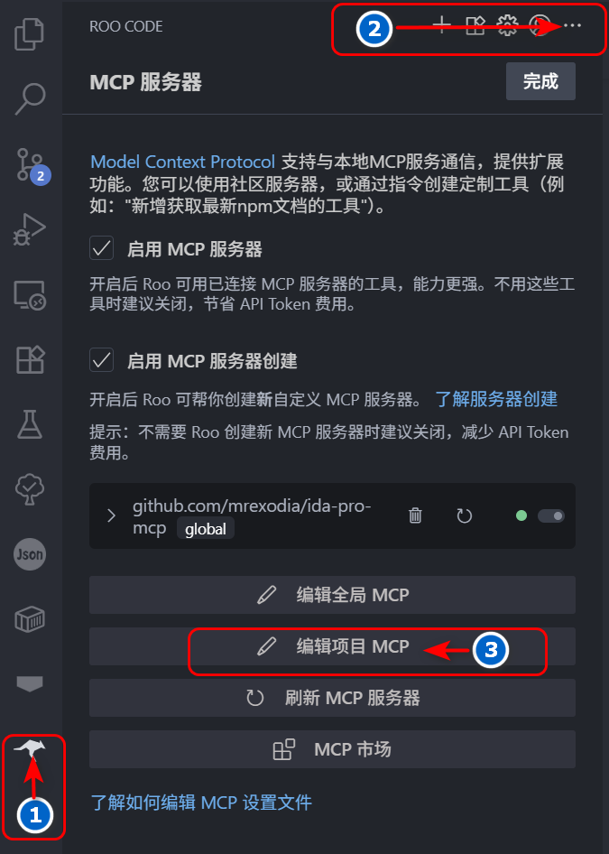

[](https://mseep.ai/app/flankerhqd-jebmcp)

A quick-and-dirty MCP server&Plugin for JEB Pro.
Tested on Cline.

Reference: https://github.com/mrexodia/ida-pro-mcp

要求：
```
安装 python3.11及以上版本
安装 uv https://docs.astral.sh/uv/getting-started/installation/
```

# RooCode 使用方法：

1. 使用 vscode 打开该工具，此时目录结构如下：

```bash
.
├── README.md
├── jeb-mcp
│   ├── pyproject.toml
│   ├── src
│   │   └── jeb_mcp
│   │       ├── MCP.py
│   │       ├── server.py
│   │       └── server_generated.py
│   └── uv.lock
└── sample_cline_mcp_settings.json
```

2. 点击左侧活动栏 rooCode 图标，然后继续点击 RooCode 对话框右上角 `...`，最后点击编辑项目 MCP 按钮，
   会在当前目录下产生一个 `.roo` 目录，其中包含 `mcp.json` 文件。



3. 修改 `mcp.json` 文件为下列内容：

```json
{
  "mcpServers": {
    "jeb": {
      "command": "uv",
      "args": ["--directory", "jeb-mcp/src/jeb_mcp", "run", "server.py"],
      "timeout": 1800,
      "disabled": false,
      "autoApprove": [
        "ping",
        "check_connection",
        "get_manifest",
        "get_all_exported_activities",
        "get_exported_activities_count",
        "get_an_exported_activity_by_index",
        "get_class_decompiled_code",
        "get_method_decompiled_code",
        "get_method_overrides",
        "get_method_callers",
        "get_superclass",
        "get_interfaces",
        "get_class_methods",
        "get_class_fields",
        "rename_class_name",
        "rename_method_name",
        "rename_field_name"
      ],
      "alwaysAllow": [
        "check_connection",
        "get_class_decompiled_code",
        "get_class_fields",
        "ping",
        "get_manifest",
        "get_all_exported_activities",
        "get_exported_activities_count",
        "get_an_exported_activity_by_index",
        "get_method_decompiled_code",
        "get_method_callers",
        "get_method_overrides",
        "get_superclass",
        "get_interfaces",
        "get_class_methods",
        "rename_class_name",
        "rename_method_name",
        "rename_class_field"
      ]
    }
  }
}
```

此时可以发现 mcp 服务器列表中已经存在 jeb mcp 服务器了。

4. 打开 jeb 菜单栏 `File->Scripts->Scripts selector...` 选中当前目录下 `jeb-mcp/src/jeb_mcp/MCP.py` 文件，
   运行脚本，此时可以在 jeb 的 logger 窗口中看到如下输出：

```bash
[MCP] Plugin loaded
[MCP] Plugin running
[MCP] Server started at http://127.0.0.1:16161
```

5. 在 RooCode 对话框中输入下列相应的任务即可，如：
```bash
1. 连接MCP JEB
2. 分析D:\xxx.apk 应用的 Lnet/xxx/MainActivity; 类的功能
3. 根据功能重命名所有方法名小于3个字符的名称
4. 如果调用了其他类的方法，分析相应的类功能，并重命名方法名小于3个字符的名称
5. 输出分析过程
```


